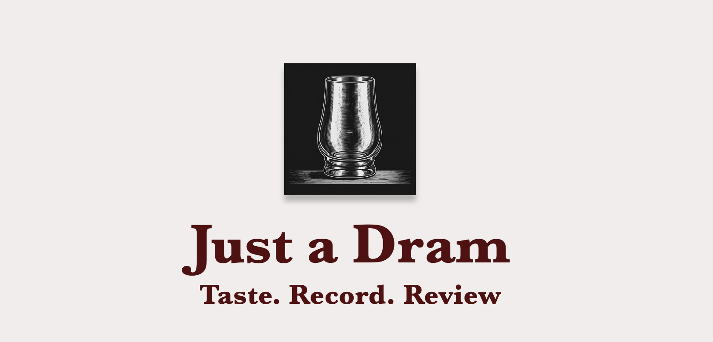

# Just a Dram

## About
 Just a Dram is an app to record the various whiskies one has tasted. The user can also add new entires to their tasting collection as well as edit or delete said entries. 
 
 So, what is a dram?  A dram is small pour (ranges from 25ml/0.85oz to 35.5ml/1.2oz.) of whisky. I didn't find this out till I started to work at a whisky distillery. I created this app beacause...

## Deployed Link
[Just a Dram](https://just-a-dram-3298747cdc46.herokuapp.com/)

## Wireframe
[Here's a sneak peak of the layout.](https://www.figma.com/design/s6JEtdtapg3hFtml88yMKO/Just-a-Dram?node-id=1-11&t=x38awTjAupDkpCkC-1)

## Attibutions
Thank you to the following for sharing such high quality images on [Unsplash](https://unsplash.com/) that were used in this project:
* [Reiseuhu](https://unsplash.com/@reiseuhu?utm_content=creditCopyText&utm_medium=referral&utm_source=unsplash) for the [rickhouse](https://unsplash.com/photos/pile-of-oak-barrels-inside-tunnel-6DnEjXP3WP4?utm_content=creditCopyText&utm_medium=referral&utm_source=unsplash) photo.
* [Nathan Dumlao](https://unsplash.com/@nate_dumlao?utm_content=creditCopyText&utm_medium=referral&utm_source=unsplash) for the [WhistlePig](https://unsplash.com/photos/captain-morgan-original-spiced-gold-bottle-97G8s6Bl_RQ?utm_content=creditCopyText&utm_medium=referral&utm_source=unsplash) photo.
* [Allan Francis](https://unsplash.com/@allanbenjaminfrancis?utm_content=creditCopyText&utm_medium=referral&utm_source=unsplash) for the [Woodford Reserve](https://unsplash.com/photos/a-bottle-of-woodford-reserve-sitting-on-a-table-jOEzl0bcXyE?utm_content=creditCopyText&utm_medium=referral&utm_source=unsplash) photo.
* [Jack Dylag](https://unsplash.com/@dylu?utm_content=creditCopyText&utm_medium=referral&utm_source=unsplash) for the [Talisker](https://unsplash.com/photos/talisker-bottle-beside-drinking-glass-JwWKV2gCPkE?utm_content=creditCopyText&utm_medium=referral&utm_source=unsplash) photo.

Thank you to ChatGPT for creating the Glencarien glass logo.
  
  

## Technologies Used
* Mongo DB
* Express
* Node.js

## Next Steps
* Incorporate user auth.
* Incoorporate a CSS library.
* Adjustments to the the following fields:
    * Hue field: Add a color meter.
    * Flavor field: Incorporate a flavor wheel.
* Add serach functionality.

